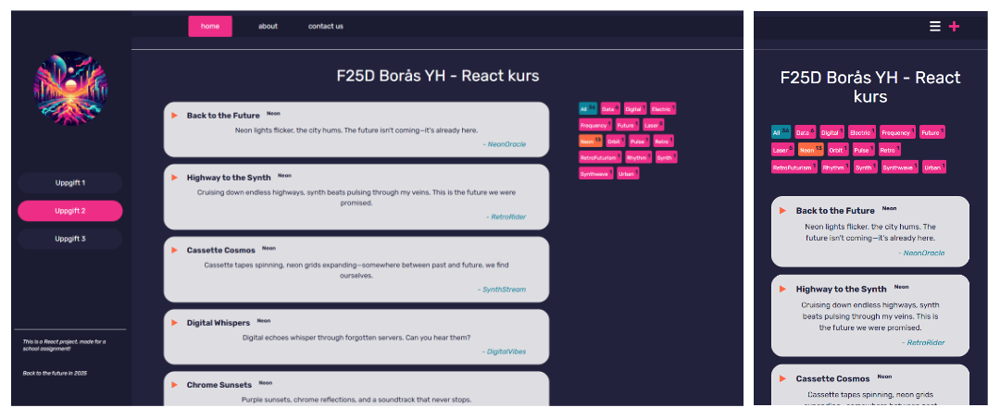

# React layout with post list

[Live Page](https://linneatoth.github.io/react_components/)

A retro themed layout, built with React, styled with Tailwind and made with Vite. This was our second assignment using React in my current web development education. 

This page's mood is a nod toward synthwave aesthetics. To stay in theme, the post content is generated by AI, tailored to suit the vibe! 

## General approach

### Component structure
This app has four levels of components (not counting main.jsx), with App.jsx at the top. As the project grew, I made sure to break it down into smaller, manageable parts. While there's a bit of prop drilling going on, I also implemented useContext to pass data more cleanly in some places. In hindsight, it may not have been strictly necessary, but I saw it as an opportunity to learn and experiment.

## Features

- Responsive design with Tailwind

- Four-level component structure with React

- useState, useEffect, and useContext for state handling

- A sprinkle of prop drilling

- Retro design with modern tech

- Built with Vite

## Reflection
Even if useContext might have been overkill, it was a good learning opportunity and gave me insight into how it works in practice.
  
Tailwind made it easier to rapidly prototype and iterate on the design, directly into the components keeping external CSS to a minimum. I found it to be well suited for the paradigm.

## Assignment, machine translated from Swedish:

> ## About the Assignment  
> In this task, you will continue building and developing the first project we started: F25D-React-app with Navbar and Sidebar.  
> You need to expand the project with more components.
> 
> ## Case  
> You have an image showing three different components (1, 2, and 3) that should be built and rendered in the `main` section of the main component (`App`).
> 
> (wireframe of the layout)
> 
> ## What You Need to Do  
> - [ ] First component: **Header**, with an `h1` that represents the main heading, placed below the navbar from the previous course.
> 
> ### 1. Main Component (`App.jsx`)
> 
> - Should contain a **Header** at the top with the text:  
>   `F25D Borås YH - React course`
> 
> - Below the Header, place two parts side by side using **grid or flexbox**:  
>   - A list of **posts** (in the middle)  
>   - **Component 2** (on the right)
> 
> - [ ] **Component 2** is a sidebar that contains several `button` elements, all styled the same with a hover effect. The buttons should be a reusable component called within the `SideMenu` component.
> 
> ### Component 2: **TagList.jsx**
> 
> - Create a component called `TagList`:  
>   - Display several buttons with the text: `"Click Tag BTN"`
> 
> ### Component 3: **PostList.jsx** and **Post.jsx**
> 
> - Create two components:  
>   - `PostList` which maps and renders several `Post` components  
>   - `Post`, which displays:  
>     - A title: `"This is The Post Title"`  
>     - Body text: `"The Post Body"`
> 
> ### 4. **Responsive Design**
> 
> - Make sure the layout changes on smaller screens (mobile):  
>   - `Component 3`, `PostList`, and `TagList` should **stack vertically** instead of side by side.  
>   - Use Tailwind's responsive classes or standard CSS media queries.
> 
> 
> ### Technical Information:
> 
> - Use regular **CSS** for styling  
> - Feel free to use **Flexbox** or **CSS Grid** for the layout
> 
> ---
> 💡  
> **Extra challenge: VG level**
> 1. Use **props** to send the title and body text to each `Post`  
> 2. Use **TailwindCSS**  
> 3. Add functionality so that clicking a button in `TagList` logs something in the console (`console.log("Button clicked!")`)  
> 4. Use an **array** to dynamically generate the buttons with `.map()`
